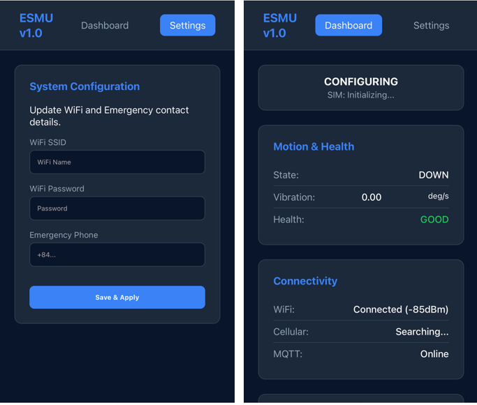
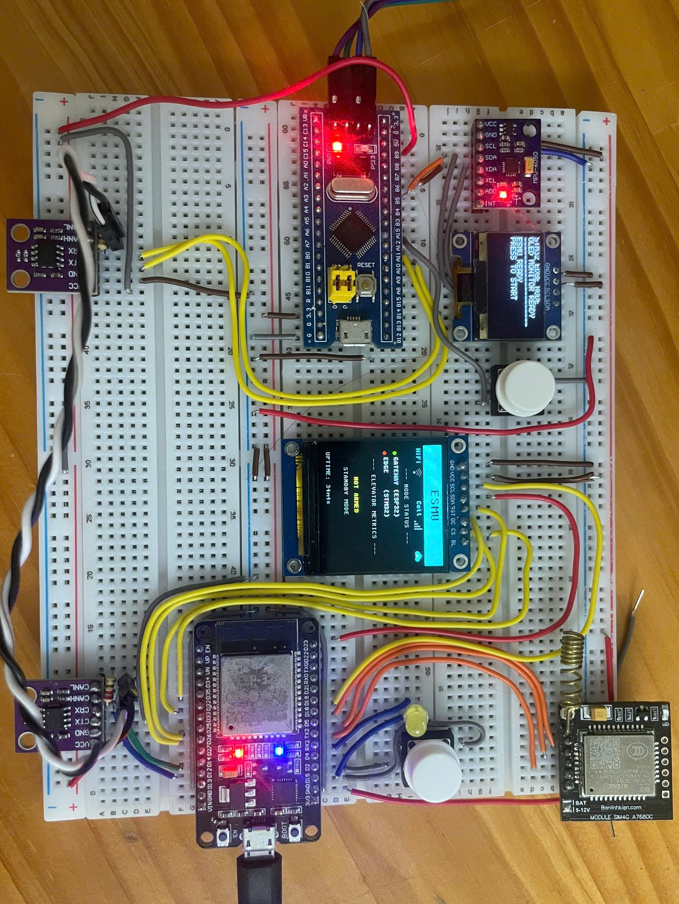

# Elevator Safety Monitoring Unit (ESMU)

[](#)
[](#)
[-orange.svg)](#)

The ESMU is a distributed safety-oriented system designed for real-time elevator health monitoring and fault detection. By separating high-frequency sensor processing from cloud connectivity, the system provides more predictable safety responses while enabling telemetry via MQTT and a local dashboard UI. A dashboard in CoreIoT for online monitoring is also supported.

## 🏗️ System Architecture

The ESMU utilizes a **Dual-Node Distributed Architecture** connected via a **CAN** bus (standard ID).

### 1. Edge Node (STM32F103)
*The "Sensor Hub"*
- **Role**: High-speed data acquisition and real-time fault detection.
- **Hardware**: STM32F103 BluePill + MPU6050 (6-axis Accel/Gyro) + SSD1306 OLED display.
- **Functions**: 
    - 100Hz motion sampling with EMA (Exponential Moving Average) filtering.
    - Fault detection algorithms (Free Fall, Sudden Impact, Overtilt, Vibration).
    - Real-time reporting of elevator health to the Gateway via CAN.
- **OS**: Native FreeRTOS.

### 2. Gateway Node (ESP32)
*The "Orchestrator"*
- **Role**: Data aggregation, local visualization, and cloud connectivity.
- **Hardware**: ESP32-WROOM + ST7789 Display + A7680C (4G LTE).
- **Functions**:
    - CAN-to-MQTT proxy for remote monitoring.
    - Dual-path telemetry: WiFi (Primary) + 4G LTE (Emergency Backup).
    - Local system registry for health tracking of all nodes.
    - Interactive UI for real-time status and diagnostic logging.
- **OS**: ESP-IDF / FreeRTOS.

## 🚀 Key Features

- **Distributed Processing**: Safety-related logic runs on the STM32 Edge node, isolated from network-induced latency on the ESP32.
- **Priority-Based CAN Protocol**:
    - **EMERGENCY (Highest)**: Immediate interrupt for detected faults. (CAN ID = 0x010)
    - **HEALTH (High)**: 100ms periodic motion/balance metrics. (CAN ID = 0X100)
    - **HEARTBEAT (Medium)**: 1s node status and uptime reporting. (CAN ID = 0X200)
- **Fail-Safe Connectivity**: `cellular_service` manages the A7680C 4G module to ensure alerts reach the user even if building internet fails.
- **Fault Detection**: Implements hysteresis and EMA filtering to prevent false positives while maintaining 100ms response times.
- **Local Diagnostics**: OLED/TFT display provides real-time "Worst-Case" logging and system-wide status at a glance.


## 🚥 Safety & Fault Logic

The system monitors four primary fault conditions:
1. **Free Fall**: Detection of acceleration below 0.35g.
2. **Sudden Impact**: Detection of acceleration exceeding 1.6g.
3. **Vibration Analysis**: Gyro-based analysis categorized into `LOW`, `WARN`, and `CRITICAL`.
4. **Emergency Stop**: Rapid deceleration detection filtered through a 5-cycle debounce window.

## 📂 Project Structure
```text
├── agent/                # AI Agent context, rules, and project roadmap
├── edge-stm32/           # STM32 Edge Node firmware (MPU6050 + CAN)
├── gateway-esp32/        # ESP32 Gateway Node firmware (WiFi + MQTT + 4G + CAN)
├── shared/               # Shared CAN protocol headers and types
└── docs/                 # Data sheets, pinouts, and register maps
```

## 🎮 System Operation

The system is designed to be interactive through physical buttons and a web interface:

### 1. Arming the System (STM32 Edge Node)
- At boot, the Edge node starts in a standby state.
- **To Arm**: Press the button connected to **GPIO 15** (User Button) on the STM32.
- The system will enter `MONITORING` mode and begin transmitting real-time safety metrics via CAN.

### 2. Entering Configuration Mode (ESP32 Gateway Node)
- To update WiFi credentials or the emergency contact number:
- **To Enter Config**: Press and hold the button on **GPIO 15** of the ESP32 for **5 seconds**.
- The Gateway enters `PROVISIONING` mode and hosts a WiFi Access Point (`ESMU-Setup`). Access `192.168.4.1` in a browser to use the management portal. In this phase, user can also access to a live monitoring page on the same web.
- **To Exit Config**: Press and hold the same button for 5s, the system will return to `MONITORING` mode.



### 3. Monitoring via CoreIoT Dashboard
- Once the Gateway is connected to WiFi, telemtry data will be sent and users can access the online CoreIoT dashboard
- The dashboard provides a chart visualization for elevator health statistics, system health of both nodes, wifi and cellular signals.


## 🔌 Hardware Components

| Category | Component | Description |
|-----------|------------|-------------|
| **Controllers** | ESP32-WROOM-32 | Gateway Node: Connectivity & UI Orchestrator |
| | STM32F103C8T6 | Edge Node: Real-time Sensor Processing |
| **Sensors** | MPU6050 | 6-axis Accelerometer & Gyroscope |
| **Displays** | ST7789 (240x240) | 1.3" IPS LCD for Gateway Dashboard |
| | SSD1306 (128x64) | 0.96" OLED for Edge Node Diagnostics |
| **Connectivity**| SIM A7680C | 4G LTE Cat-1 Module for Emergency Alerts |
| | MCP2551 | High-speed CAN Bus Transceivers |

## 🔌 Wiring & Pinout

### 1. Gateway Node (ESP32)
| Function | ESP32 Pin | Component |
| :--- | :--- | :--- |
| **CAN Bus** | GPIO 12 (TX), 13 (RX) | MCP2551 Transceiver |
| **LTE Module** | GPIO 17 (TX), 16 (RX) | SIM A7680C UART |
| **TFT Display** | GPIO 18 (SCK), 23 (MOSI) | ST7789 SPI Bus |
| **Config Btn** | GPIO 15 | User Button |

### 2. Edge Node (STM32)
| Function | STM32 Pin | Component |
| :--- | :--- | :--- |
| **CAN Bus** | PA11 (RX), PA12 (TX) | MCP2551 Transceiver |
| **MPU6050** | PB6 (SCL), PB7 (SDA) | I2C Bus |
| **OLED Screen**| PB6 (SCL), PB7 (SDA) | I2C Bus (Shared) |
| **Arm Button** | PA15 | User Button |

### Inter-Node Connection
The two nodes are connected via a simple 2-wire differential **CAN Bus**:
- **CAN_H** (Gateway) <--> **CAN_H** (Edge)
- **CAN_L** (Gateway) <--> **CAN_L** (Edge)
- *Note: Ensure a 120Ω terminating resistor is placed at both ends of the bus.*




## 🚧 Future Work

- Integrate with elevator motor control interface for direct monitoring and response  
- Improve motion analysis and fault detection algorithms  
- Enhance system reliability and real-time performance  

## 👥 Target Users

- Homeowners with private elevators and small businesses, adding an extra layer of safety and monitoring  
- Elevator engineers who need to monitor system health remotely and receive immediate alerts when faults occur  

## Note 
This project was built to explore an end-to-end system. Motion analysis and fault detection will be improved in the future as the system evolves. Thanks for paying this repository a visit. 
Feedback and suggestions are welcome.
---
